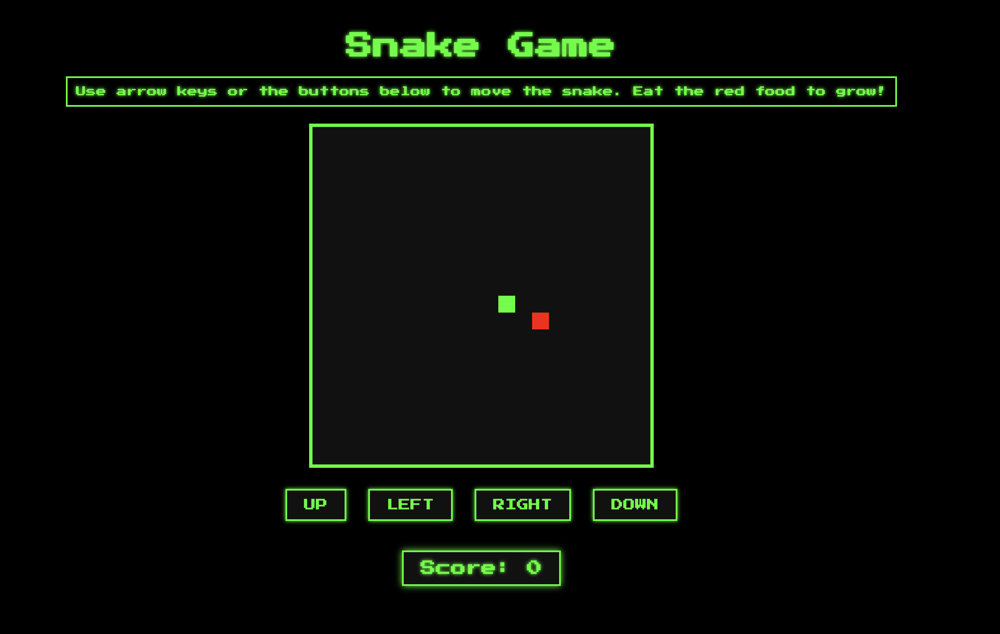
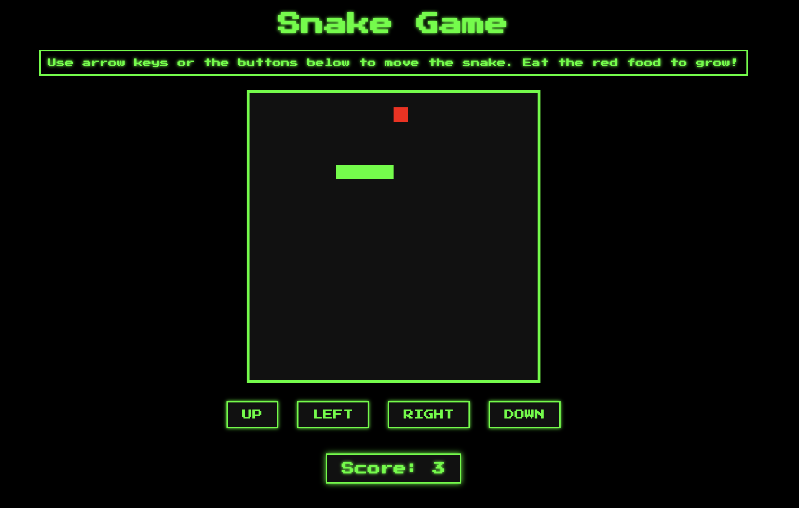
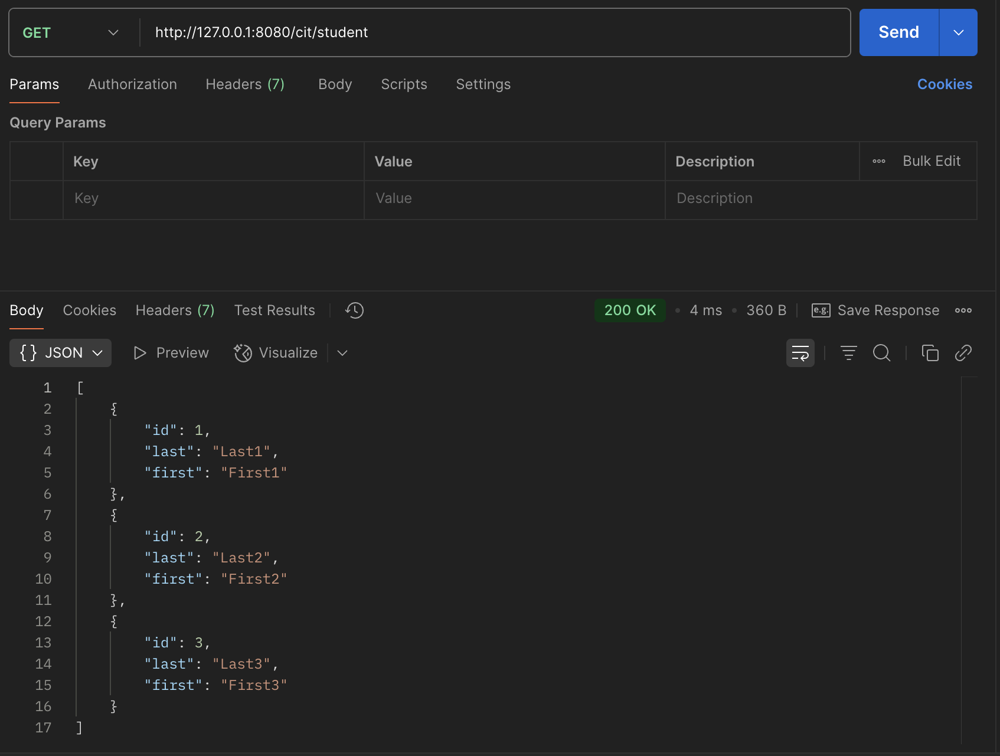
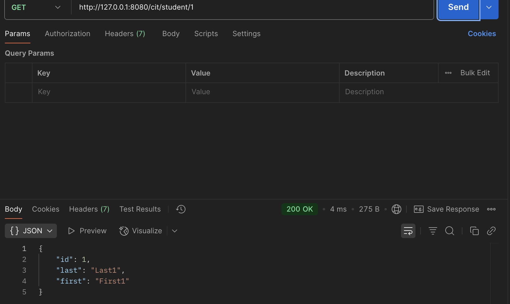
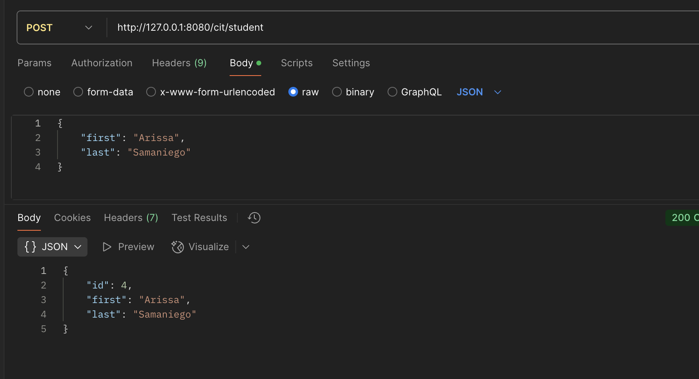
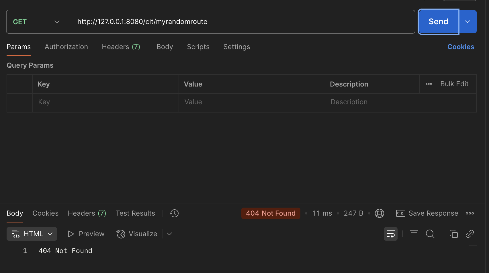

# Project 5: Web-Based Snake Game

Welcome to my Project 5 page for **CIT 281**.

---

## Purpose

In this project, I created a web-based Snake game using JavaScript classes, code modules, and a Node.js web server. I gained hands-on experience with class constructors and methods, working with objects and arrays, and debugging server-side code in VSCode. This project combined programming fundamentals with fun by integrating AI assistance in the development process.

---

## Technologies Used

- Visual Studio Code (VSCode)
- Node.js
- Express.js
- JavaScript
- HTML/CSS

---

## Lab 5: Express Server & Postman API Testing

In this lab, I used Postman to test a Node.js and Express server that handled GET and POST requests, responded with JSON data, and managed an array of student objects.

---

## Lab 6: JavaScript Classes & Object-Oriented Programming

In this lab, I explored JavaScript classes by creating and testing Book and Library classes, adding books with ISBNs, and implementing a method to delete books from the library.

---

## What I Learned

- How to build a Node.js and Express-based web application.
- How to create interactive browser-based games using DOM manipulation.
- How to build GET and POST routes that send and receive JSON.
- How to define and manipulate arrays of objects (e.g., student data).
- How to define constructors, properties, and methods in a class.
- How to create custom methods to modify object collections

---

## Project Images

---

## Lab 5 Images

---

Thanks for visiting my Project 5 page!

[Back to Portfolio](https://arissas24.github.io/)

